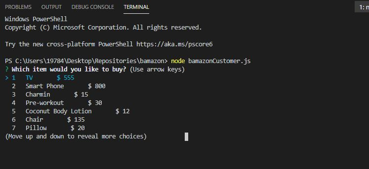
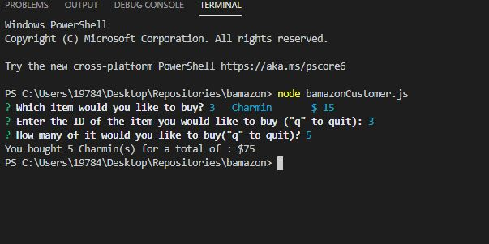

# <b>Welcome to BAMAZON!</b> 

## The slightly, but not really, better Amazon (not affiliated... although, sometimes we wish). This store is very small (we have, literally, a few items). 

> Essentially, what this does is use node and MySQL to show items for sale. You can see the items for sale, select the item you want to purchase, and enter the quantity you want. It will then show you an amazing total. Please view the images below to see how this works. 

 
 

